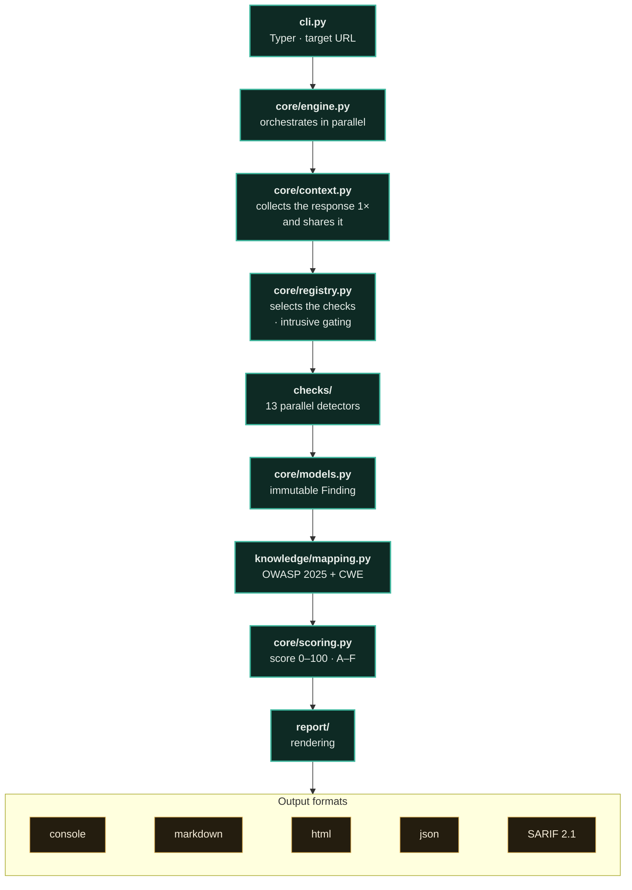

<p align="right"><a href="README.md">🇧🇷 Ler em Português</a></p>

<a href="https://paulo-marcos-lucio.github.io"></a>

<div align="center">

# 🛡️ Sentinela

<sub>Portuguese for "Sentinel"</sub>

### Non-intrusive security diagnostics for web applications — with a client-ready report.

*Discover in seconds how your application's server exposes itself on the internet: security headers, TLS/certificate, cookies, CORS, HTTP methods, information disclosure, form and injection surface (passive), and DNS/email security — mapped to **OWASP Top 10:2025** and delivered as a professional report.*

[](https://github.com/Paulo-Marcos-Lucio/sentinela/actions/workflows/ci.yml)
[](https://github.com/Paulo-Marcos-Lucio/sentinela/actions/workflows/codeql.yml)
[](https://www.python.org/)
[](LICENSE)
[](https://github.com/astral-sh/ruff)
[](https://mypy-lang.org/)
[](https://owasp.org/Top10/2025/)
[](#-engineering-quality--method)
[](#-engineering-quality--method)

</div>

---

## 📌 The problem

Most data leaks and incidents at SMEs and fintechs **don't** start with a sophisticated intrusion technique. They start with badly configured basics: a `.env` file forgotten in the site root, a certificate about to expire, session cookies without `HttpOnly`, a CORS policy that returns authenticated data to any origin, a domain without SPF that becomes a phishing vector.

This "basic" layer is exactly what a well-executed diagnostic finds **before** the attacker does — and it's what **Sentinela** automates, turning a scan into a report that the technical team understands and that leadership can read.

> **Why is this urgent in Brazil?** LGPD (Brazil's data-protection law, GDPR-equivalent) requires, in its art. 46, technical security measures **and dated, effective proof that they exist**. ANPD is in an active enforcement cycle and has already fined companies of every size. A recurring vulnerability diagnostic is one such piece of evidence — and it's a mitigating factor that ANPD weighs when calculating the severity of any sanction.

---

## ✨ What Sentinela checks

| Module | What it analyzes | OWASP 2025 |
| --- | --- | --- |
| **Headers** | HSTS, CSP with **in-depth analysis** (wildcard, `object-src`, `base-uri`, `report-only`), X-Content-Type-Options, X-Frame-Options / clickjacking, Referrer-Policy, Permissions-Policy, COOP, legacy X-XSS-Protection | A02 |
| **TLS / Certificate** | Legacy protocols (TLS 1.0/1.1), **absence of TLS 1.3**, cipher **without Perfect Forward Secrecy**, expired/expiring certificate, mismatched hostname, weak RSA key, obsolete signature, untrusted chain | A04 |
| **Transport** | HTTP → HTTPS redirection | A04 |
| **Cookies** | `Secure`, `HttpOnly`, `SameSite` flags — includes insecure `SameSite=None` and `__Host-`/`__Secure-` prefixes | A01 / A04 / A07 |
| **CORS** | Origin reflection, wildcard with credentials, permissive policies | A01 |
| **HTTP Methods** | `TRACE` (XST), exposed write methods (`PUT`/`DELETE`) | A02 |
| **Info exposure** | Leaked server/stack version, directory listing | A02 |
| **Page content** | Mixed content, missing **SRI** on third-party resources, form with insecure `action`, password field without HTTPS | A03 / A04 |
| **Forms & injection (passive)** | Credentials traveling through a `GET` form, form with credentials posting to `http://` (mixed content), state-changing form without an anti-CSRF token, reflected parameter without escaping (XSS surface), and sensitive data in the query string — reading only the already-downloaded HTML, **without sending a single attack payload** | A01 / A04 / A05 / A07 |
| **Public files** | `robots.txt` (RFC 9309) revealing sensitive paths by convention | A02 |
| **Attack surface** | Subdomain discovery via **Certificate Transparency** and **subdomain takeover** detection (orphaned CNAME) — opt-in `--descobrir` | A02 |
| **DNS / Email** | SPF, DMARC (policy), CAA, DNSSEC, **MTA-STS**, **TLS-RPT** | A02 / A04 / A07 |

Each finding comes with **severity** (anchored to CVSS ranges), **evidence**, **impact**, **practical recommendation**, and **references** (OWASP, MDN, RFC), plus the **OWASP Top 10:2025 + CWE** classification.

> **The passive↔active boundary is explicit — by design.** The `forms` checker is the slice of injection that can be honestly evaluated without sending a payload: it only reads the HTML the engine already downloaded once and flags the *surface* (this is an attack surface), without ever claiming it is exploitable (this would actually trigger it) — because it sent nothing to prove it. In a field trial against a controlled lab, this passive layer measured **0.909 precision/recall**, with the `SENHA_EM_GET` class at **1.00**. **Active confirmation** — proving SQLi/XSS with an inert marker — belongs to the Pro edition (see **🔓 Pro Edition** section below), gated and subject to authorization.
>
> **Robustness against a hostile target:** form extraction and reflection search use a **bounded scanning regex** (2048-byte cap per tag, `O(n)`) — not the stdlib's `HTMLParser`, which degrades on an unclosed 256 KB `<script` (the same class of DoS already fixed in the content checker). A 256 KB hostile body is scanned in trivial time, with a **test that times the regression** (fails if it exceeds 1 s).

> **Scope, no sugarcoating:** the automated scan **does not replace** a manual pentest — business logic flaws, injection, and authorization issues require dedicated human testing. Sentinela covers the **configuration and hygiene** layer (OWASP A02 and A04) in depth — which is where most low-cost, high-impact problems live.

---

## 🚀 Quickstart — from zero to your first report

**Prerequisite:** Python **3.10+** (tested on 3.10 → 3.13; also works on 3.14). Check with `python --version`.

```bash
# 1. install from the repository (Sentinela is not on PyPI — see note below)
pip install "git+https://github.com/Paulo-Marcos-Lucio/sentinela.git"

# 2. run the non-intrusive diagnostic against YOUR target (domain or URL)
sentinela scan seu-dominio.com.br

# 3. generate the HTML report, ready to deliver
sentinela scan seu-dominio.com.br -f html -o relatorio.html
```

That's all it takes for the first result: step 2 prints, to the terminal, the **hygiene score
(0–100, A–F)**, a **prioritized action plan**, and every finding with severity, evidence,
impact, recommendation, and the **OWASP Top 10:2025 + CWE** classification. Step 3 writes the
same diagnostic as a self-contained HTML file for the client. No configuration is required.

> The default scan is **non-intrusive**: it only reads what the server already exposes to a
> regular visitor. Even so, **only run it against targets you own or have written
> authorization to assess** (see the **⚖️ Ethical use and authorization** section).

---

## 🚀 Installation

Requires **Python 3.10+**.

Sentinela **is not published on PyPI**, so `pip install sentinela` will NOT install this
tool — that name belongs to a different project (an operating-system watchdog). Installation
is done directly from the repository. Choose **one** of the following methods:

```bash
# A) pip — installs into the current environment/venv (the method tested above)
pip install "git+https://github.com/Paulo-Marcos-Lucio/sentinela.git"

# B) pipx — isolated environment + global `sentinela` command (recommended for daily use)
pipx install "git+https://github.com/Paulo-Marcos-Lucio/sentinela.git"

# C) from source, for development (brings in ruff, mypy, pytest)
git clone https://github.com/Paulo-Marcos-Lucio/sentinela.git
cd sentinela
pip install -e ".[dev]"
```

Or run it isolated, without installing anything on the host, via Docker:

```bash
docker build -t sentinela .
docker run --rm sentinela scan exemplo.com.br
```

> **Isolation tip (pip):** to avoid mixing with other packages, create a venv first —
> `python -m venv .venv && . .venv/Scripts/activate` (Windows) or
> `python -m venv .venv && source .venv/bin/activate` (Linux/macOS) — then run method **A**.

---

## 🧑‍💻 Usage

```bash
# default (non-intrusive) scan with terminal output
sentinela scan exemplo.com.br

# generate the professional HTML report (the client deliverable)
sentinela scan https://exemplo.com.br -f html -o relatorio-exemplo.html

# multiple formats at once
sentinela scan exemplo.com.br -f console -f markdown -f json

# CI/CD usage: fail the pipeline if there's a finding of high severity or above
sentinela scan exemplo.com.br --falhar-em alta

# discover subdomains via Certificate Transparency (passive, slower)
sentinela scan exemplo.com.br --descobrir

# list the checks and the findings catalog
sentinela regras

# version
sentinela --version
```

Main `scan` options:

| Option | Description |
| --- | --- |
| `-f, --formato` | `console` (default), `markdown`, `html`, `json`, `sarif`. Repeatable. |
| `-o, --saida` | Output file for a file-based format. |
| `--falhar-em` / `--fail-on` | `nenhum`/`info`/`baixa`/`media`/`alta`/`critica` (or `none`/`info`/`low`/`medium`/`high`/`critical`) — exit code 1 for CI. Default: `alta`. |
| `--timeout` | Timeout per request, in seconds (default 8). |
| `--pular` / `--somente` | Filters which checks run (by ID). Nonexistent ID → usage error (exit code 2). |
| `--perfil` | `completo` (default) runs everything; `rapido` skips TLS, DNS/email, and robots.txt (fast triage). |
| `--descobrir` | Enumerates subdomains via Certificate Transparency and checks for subdomain takeover. Passive, but slower. |
| `--sem-verificacao-tls` | **INSECURE**: disables certificate validation on connections (subject to MITM). TLS findings are still reported. |

**Exit codes:** `0` scan completed · `1` finding at the `--falhar-em` level or above · `2` usage error (invalid target, nonexistent check ID, unknown level).

**`--fail-on` default across the suite** — the defaults are NOT the same, and that's deliberate:

| Tool | Default | Why |
| --- | --- | --- |
| Sentinela | `alta` | A missing header is hardening; the gate closes on what represents real risk. |
| Guardião | `media` | SECRET scanner: the medium band is where CPF/CNPJ (LGPD) and high-entropy strings live. The consequence of a leaked credential is categorically worse — the trigger has to be more sensitive. |
| Chaveiro | `alta` | Analysis of a single token. |
| Esteira | `alta` | CI configuration. |

**Reproducible example (against a local target).** Serve any folder over HTTP and point Sentinela at it:

```bash
# in one terminal: start a local server with no security headers
python -m http.server 8899

# in another terminal: diagnose that target
sentinela scan http://127.0.0.1:8899 --perfil rapido
```

Expected summary output (`http.server` has neither HTTPS nor security headers — the tool's
human-facing text, including this output, is Portuguese by design; see **PT-BR is a conscious
decision** below):

```
 D   55/100          Alta 1 · Média 2 · Baixa 3 · Informativa 2
 ALTA   SEM_HTTPS                 — Alvo servido sem HTTPS (texto aberto)   · A04:2025 · CWE-319
 MÉDIA  CSP_AUSENTE               — Content-Security-Policy ausente         · A02:2025
 MÉDIA  CLICKJACKING_SEM_PROTECAO — sem X-Frame-Options/CSP frame-ancestors · A02:2025
 …
```

📄 **See a real example report:** [`docs/exemplo-relatorio.md`](docs/exemplo-relatorio.md)

---

## 🔓 Pro Edition (private) — the reading that crosses the line

What's here is the **showcase**: the **non-intrusive**, open, defensive diagnostic. The **Pro edition is private** — on purpose. It unlocks deep reading, and a capability like that in anyone's hands is a risk, not a feature. What changes, side by side with the showcase:

| Dimension | Public — the showcase (you run it) | Pro — private, `--autorizado` |
| --- | --- | --- |
| **Posture** | Passive · **zero attack payloads** — reads only what the server already delivered | Active · sends an **inert marker** (never an exploit), gated by written scope |
| **Injection (SQLi / XSS / …)** | **Flags the surface**: reflected parameter, form without CSRF, credential in `GET` — passive layer measured **0.909** precision/recall in the field | **Confirms** whether it actually fires — **1.00 precision · 1.00 recall** across 7 classes in the lab, **0 false positives** on the corrected side |
| **Depth** | Diagnoses **the URL you typed** | **Crawler**: maps the application (pages, SPA routes read from the bundle, endpoints) and diagnoses **page by page** |
| **API** | Does not evaluate the API contract | Enumerates **OpenAPI** operations, flags the ones without authentication, and **confirms live** whether auth is enforced — read-only, without touching action routes |
| **Probing** | Only the surface the target already exposes (`robots.txt`, headers, TLS…) | Dozens of **sensitive routes and artifacts** + detection of **debug mode / verbose errors**, safely probing the server (read-only) |
| **What changes** | you read the **facade** | **more code**: the active confirmation engine, which **does not exist** in the public edition |

**To be direct:** in this tool, Pro is **more code**, not just a service — the active injection-confirmation engine does not exist in the public edition, which stays on passive reading by design. (In the rest of the AppSec suite, the public engine is the same one; there, Pro is a **service** — consulting, authorized PoC, guided retesting.) And this active layer is **gated**: it only runs with `--autorizado` and written scope, because it sends traffic that the system's owner will see and log. It doesn't exploit, doesn't extract data, doesn't persist anything: it only turns "this is a surface" into "this confirms it."

It's the difference between reading the facade and **seeing beneath the surface** — always under authorization and scope.

> **Does your application need this level of scrutiny?** I provide the full diagnostic, remediation, and retest — with the rigor of someone who learned Brazil's regulated financial systems **by writing reference implementations of them** (Pix, Open Finance, FAPI/mTLS — public repositories).

<div align="center">

[](https://paulo-marcos-lucio.github.io)
[](https://www.linkedin.com/in/paulo-marcos-a07379174/)

</div>

---

## 🏗️ Architecture

**In 20 seconds:** you point it at a URL; the engine performs **one** response collection (HTTP/TLS/DNS) and shares it with every check, which run **in parallel** — ten header checks don't fire ten requests. Every check that finds something emits an immutable `Finding`; the taxonomy classifies that finding under **OWASP Top 10:2025 + CWE**, and the score becomes a **hygiene score** (0–100, A–F). In the end, the same result is rendered in five formats — from the human-facing report (console, Markdown, HTML) to the machine contract (JSON `suite-appsec/1` and SARIF 2.1.0). In short: a URL goes in, a configuration diagnostic ready for the client **and** for the pipeline comes out.



Layered project, with every check isolated and testable:

```
src/sentinela/
├── core/          # models, engine, HTTP client, configuration, scoring
├── checks/        # one check per file, all inheriting from Checker
├── report/        # renderers: console (rich), markdown, html (jinja2), json, sarif
├── knowledge/     # canonical references + OWASP/CWE taxonomy
└── cli.py         # typer interface
```

Checks **never** talk to the network directly: they receive an immutable `Probe` object, which makes them testable without touching the internet and concentrates timeouts/errors in a single place. A failure in an individual check is caught and logged — it never brings down the entire scan.

---

## 🔬 Engineering quality & method

**Gates, measured right now (not aspiration):** 351 tests (including property-based tests with Hypothesis) · 93% coverage (anti-regression gate `--cov-fail-under=90`) · `mypy --strict` clean across 42 files · `ruff` lint+format clean — with the `S`/bandit and `B`/bugbear security rules enabled · CI on a Python **3.10 / 3.11 / 3.12 / 3.13** matrix. `make test`, `pre-commit`, and CI all run the same command: there's no gate that only passes on my machine.

**Tests that don't accept a facade.** Beyond the happy path, the suite has invariant and timed tests that go red if detection is undone or degraded. Real examples from the repo: `test_corpo_hostil_nao_trava_a_varredura` times form extraction against a 256 KB hostile body and **fails if it exceeds 1 s** — locking the DoS regression down by SHA (the stdlib's `HTMLParser` took >120 s); and `test_nota_e_monotonica_acrescentar_achado_nunca_melhora` proves the property that adding a finding **never** improves the score — accidentally recalibrating the curve turns it red.

**Architecture — what's actually in the code:**
- **Separation of concerns:** detection (`checks/`, one check per file) × taxonomy (`knowledge/`) × rendering (`report/`); each check receives an **immutable** `Probe` and never talks to the network directly — testable without touching the internet.
- **Single source of truth:** the `finding.id → OWASP Top 10:2025 + CWE` map lives in a single module (`knowledge/mapping.py`), with the edition (`2025`) as its own field in the JSON/SARIF — the consumer doesn't need to parse a label to know that `A03:2025` ≠ `A03:2021`.
- **Stable output contract:** JSON in the `suite-appsec/1` schema (keys in EN, human-facing text in PT-BR) and **SARIF 2.1.0** ingestible by GitHub's *Security* tab, with `partialFingerprints` per instance (two distinct subdomain takeovers don't get merged into a single alert).
- **Bindable report:** every report carries its provenance — `commit` (the code that ran), `ruleset_hash` (the catalog that ran), and `artifact_sha256` (the delivered document, verifiable without the tool — [recipe here](docs/reprodutibilidade.md#a-que-código-e-a-que-regras-o-laudo-se-prende)). The seal appears in the **JSON, the SARIF, and the HTML/Markdown footer** — the human-facing deliverable is bindable too. This is what lets a retest distinguish "the target was fixed" from "the rule changed." **Note:** when installed via wheel (`pip install git+https…`, no `.git`), `commit` comes out `null` — that's honest, not a made-up SHA. To stamp it in the quickstart flow, export `SENTINELA_COMMIT=$(git rev-parse HEAD)` (in CI it already comes from the checkout).
- **Strict types + immutability:** `Finding`, `Target`, `Probe`, and `Tag` are `@dataclass(frozen=True, slots=True)`; severity is an `IntEnum` (sorts from most to least severe with no extra logic).

**The repo's own supply chain:** CI actions are pinned by **SHA** (an `@v4` tag is a moving pointer), with `persist-credentials: false`, and **Dependabot** covers the other half — PRs grouped weekly for `github-actions` and `pip`. It's the same bar that Esteira, this suite's CI tool, holds every client to.

**PT-BR is a conscious decision, not an oversight:** code identifiers in English (market standard); all human-facing text — tests, findings, docs — in PT-BR, because the one reading the final report is the client. The contract's consistency is tested.

---

## ⚖️ Ethical use and authorization

**This tool is for assessing systems that you own or have explicit, written authorization to test.**

- The **default mode is non-intrusive**: it only observes what the server already exposes to an ordinary visitor (headers, TLS, public DNS queries). The **forms and injection** check is also passive — it reads the already-downloaded HTML and **sends no attack payload whatsoever**.
- **Active injection confirmation** (Pro edition) is the exception that generates probe traffic: that's why it's **gated** — it requires `--autorizado` and written scope, and sends an inert marker, never an exploit.
- Even so, **only run it against domains you own or have written authorization to assess**. Request volume and log records belong to the system's owner, not to you.
- In Brazil, unauthorized access to a computer device is a crime (**Law 12.737/2012**, aggravated by **Law 14.155/2021**). **Written authorization with a defined scope** is what removes the unlawfulness. Also consider the **Marco Civil da Internet** (Law 12.965/2014) and **LGPD** (Law 13.709/2018) when handling any data found.

Use responsibly. See [`SECURITY.md`](SECURITY.md) for responsible disclosure.

---

## 🧭 Roadmap

- [ ] Detection of outdated front-end libraries (fingerprinting) — A03 Supply Chain
- [x] Subresource Integrity (SRI) check on third-party scripts
- [x] *Dangling CNAME* / subdomain takeover alert (discovery via Certificate Transparency, opt-in `--descobrir`)
- [x] Export to **SARIF 2.1.0** (`-f sarif`) — ingestible by GitHub's *Security* tab
- [x] Scan profiles (`--perfil completo|rapido`)

---

## 🤝 Contributing

Contributions are welcome! See [`CONTRIBUTING.md`](CONTRIBUTING.md). Run the quality suite before opening a PR:

```bash
ruff check . && ruff format --check . && mypy src && pytest
```

## 📄 License

[MIT](LICENSE) © 2026 Paulo Marcos Lucio.

---

<div align="center">

### 👋 About the author

**Paulo Marcos Lucio** — a Java/Spring developer who learned Brazil's **regulated financial systems** the hard way: by writing **reference implementations** of them (Pix, Open Finance, FAPI/mTLS authentication — public repositories). Today he works in **web application security**: vulnerability diagnosis and remediation, hardening, and failure prevention.

**Need a security diagnostic for your web application?**

[](https://www.linkedin.com/in/paulo-marcos-a07379174/)
[](mailto:contatopml26@gmail.com)
[](https://paulo-marcos-lucio.github.io)

</div>
