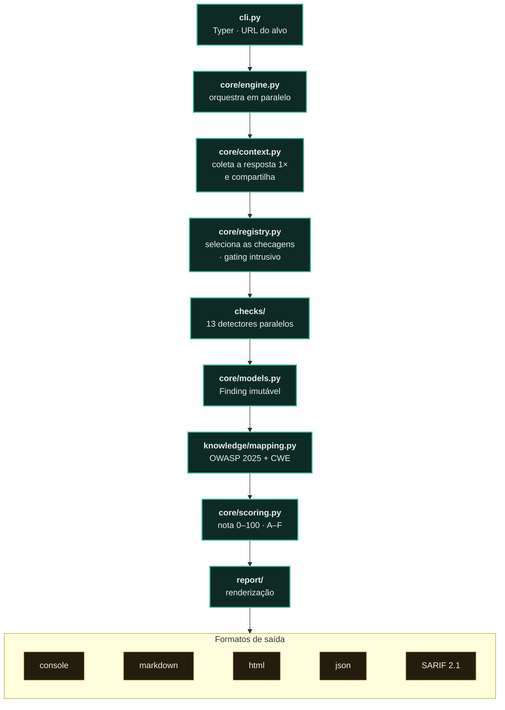

<p align="center"><a href="README.en.md"></a></p>

<a href="https://paulo-marcos-lucio.github.io"></a>

<div align="center">

# 🛡️ Sentinela

### Diagnóstico não-intrusivo de segurança para aplicações web — com relatório pronto para o cliente.

*Descubra em segundos como o servidor da sua aplicação se expõe na internet: cabeçalhos de segurança, TLS/certificado, cookies, CORS, métodos HTTP, exposição de informação, superfície de formulários e injeção (passiva) e segurança de DNS/e-mail — mapeado ao **OWASP Top 10:2025** e entregue como um relatório profissional.*

[](https://github.com/Paulo-Marcos-Lucio/sentinela/actions/workflows/ci.yml)
[](https://github.com/Paulo-Marcos-Lucio/sentinela/actions/workflows/codeql.yml)
[](https://www.python.org/)
[](LICENSE)
[](https://github.com/astral-sh/ruff)
[](https://mypy-lang.org/)
[](https://owasp.org/Top10/2025/)
[](#-qualidade-de-engenharia--método)
[](#-qualidade-de-engenharia--método)

</div>

---

## 📌 O problema

A maioria dos vazamentos e incidentes em PMEs e fintechs **não** começa por uma técnica sofisticada de invasão. Começa pelo básico mal configurado: um `.env` esquecido na raiz do site, um certificado prestes a vencer, cookies de sessão sem `HttpOnly`, um CORS que devolve dados autenticados para qualquer origem, um domínio sem SPF que vira vetor de phishing.

Esse "básico" é justamente o que um diagnóstico bem-feito encontra **antes** do atacante — e é o que a **Sentinela** automatiza, transformando uma varredura em um relatório que o time técnico entende e que a diretoria consegue ler.

> **Por que isso é urgente no Brasil?** A LGPD (art. 46) exige medidas técnicas de segurança **e a prova, datada e efetiva, de que elas existem**. A ANPD está em ciclo fiscalizatório e já multou empresas de todos os portes. Um diagnóstico recorrente de vulnerabilidades é uma dessas evidências — e é fator atenuante que a ANPD pondera na dosimetria de eventual sanção.

---

## ✨ O que a Sentinela verifica

| Módulo | O que analisa | OWASP 2025 |
| --- | --- | --- |
| **Cabeçalhos** | HSTS, CSP com **análise profunda** (curinga, `object-src`, `base-uri`, `report-only`), X-Content-Type-Options, X-Frame-Options / clickjacking, Referrer-Policy, Permissions-Policy, COOP, X-XSS-Protection legado | A02 / A04 |
| **TLS / Certificado** | Protocolos legados (TLS 1.0/1.1), **ausência de TLS 1.3**, cifra **sem Perfect Forward Secrecy**, certificado expirado/expirando, hostname divergente, chave RSA fraca, assinatura obsoleta, cadeia não confiável | A04 |
| **Transporte** | Redirecionamento de HTTP → HTTPS | A04 |
| **Cookies** | Flags `Secure`, `HttpOnly`, `SameSite` — inclui `SameSite=None` inseguro e prefixos `__Host-`/`__Secure-` | A01 / A02 / A04 / A07 |
| **CORS** | Reflexão de origem, curinga com credenciais, políticas permissivas | A01 |
| **Métodos HTTP** | `TRACE` (XST), métodos de escrita expostos (`PUT`/`DELETE`) | A02 |
| **Exposição de info** | Versão de servidor/stack vazada, listagem de diretório | A02 |
| **Conteúdo da página** | Conteúdo misto (*mixed content*), ausência de **SRI** em recursos de terceiros, formulário com `action` insegura, campo de senha sem HTTPS, cache de página sensível sem `no-store` | A02 / A03 / A04 |
| **Formulários & injeção (passiva)** | Credencial trafegando em formulário `GET`, formulário com credencial postando para `http://` (conteúdo misto), formulário que muda estado sem token anti-CSRF, parâmetro refletido sem escape (superfície de XSS) e dado sensível na query string — lendo só o HTML já baixado, **sem enviar um único payload de ataque** | A01 / A04 / A05 / A07 |
| **Arquivos públicos** | `robots.txt` (RFC 9309) revelando caminhos sensíveis por convenção | A02 |
| **Arquivos e rotas sensíveis** | `.git/HEAD`, `.env`, `.svn/entries`, `mod_status` do Apache, `phpinfo()` — cada caminho com **assinatura de conteúdo** própria, para não confundir um 200 genérico de SPA com o artefato de verdade — opt-in `--autorizado` (é tráfego que vai além de visitar o site) | A02 |
| **Superfície de ataque** | Descoberta de subdomínios via **Certificate Transparency** e detecção de **subdomain takeover** (CNAME órfão) — opt-in `--descobrir` | A02 |
| **DNS / E-mail** | SPF, DMARC (política), CAA, DNSSEC, **MTA-STS**, **TLS-RPT** | A02 / A04 / A07 |

Cada achado vem com **severidade** (ancorada nas faixas do CVSS), **evidência**, **impacto**, **recomendação prática** e **referências** (OWASP, MDN, RFC), além da classificação **OWASP Top 10:2025 + CWE**.

> **A fronteira passivo↔ativo é explícita — de propósito.** O checker `forms` é a fatia de injeção que dá para avaliar com honestidade sem enviar payload: ele lê apenas o HTML que o motor já baixou uma vez e sinaliza a *superfície* (isto é uma superfície de ataque), sem nunca afirmar que ela é explorável (isto dispararia de fato) — porque não mandou nada para provar. Em bateria de campo contra um laboratório controlado, essa camada passiva mediu **precisão/recall de 0,909**, com a classe `SENHA_EM_GET` em **1,00**. A **confirmação ativa** — provar SQLi/XSS com um marcador inerte — é da edição Pro (seção **🔓 Versão Pro**, abaixo), gated e sob autorização.
>
> **Robustez contra alvo hostil:** a extração de formulários e a busca por reflexão usam **regex de escaneamento limitado** (teto de 2048 bytes por tag, `O(n)`) — não o `HTMLParser` da stdlib, que degrada num `<script` de 256 KB sem fechamento (a mesma classe de DoS que já foi corrigida no checker de conteúdo). Um corpo hostil de 256 KB é varrido em tempo trivial, com **teste que cronometra a regressão** (falha se passar de 1 s).

> **Escopo, sem rodeio:** a varredura automatizada **não substitui** um pentest manual — falhas de lógica de negócio, injeção e autorização exigem teste humano dedicado. A Sentinela cobre com profundidade a camada de **configuração e higiene** (OWASP A02 e A04), que é onde mora a maior parte dos problemas de baixo custo e alto impacto.

---

## 🚀 Quickstart — do zero ao primeiro relatório

**Pré-requisito:** Python **3.10+** (testado em 3.10 → 3.13; funciona também em 3.14). Verifique com `python --version`.

```bash
# 1. instale a partir do repositório (a Sentinela não está no PyPI — ver nota abaixo)
pip install "git+https://github.com/Paulo-Marcos-Lucio/sentinela.git"

# 2. rode o diagnóstico não-intrusivo contra o SEU alvo (domínio ou URL)
sentinela scan seu-dominio.com.br

# 3. gere o relatório HTML pronto para entregar
sentinela scan seu-dominio.com.br -f html -o relatorio.html
```

Isso é tudo para o primeiro resultado: o passo 2 imprime, no terminal, a **nota de higiene
(0–100, A–F)**, um **plano de ação priorizado** e cada achado com severidade, evidência,
impacto, recomendação e a classificação **OWASP Top 10:2025 + CWE**. O passo 3 grava o mesmo
diagnóstico como um HTML autocontido para o cliente. Nenhuma configuração é obrigatória.

> A varredura padrão é **não-intrusiva**: só lê o que o servidor já expõe a um visitante
> comum. Ainda assim, **rode apenas contra alvos que você possui ou tem autorização por
> escrito para avaliar** (ver a seção **⚖️ Uso ético e autorização**).

---

## 🚀 Instalação

Requer **Python 3.10+**.

A Sentinela **não está publicada no PyPI**, então `pip install sentinela` NÃO instala esta
ferramenta — esse nome pertence a outro projeto (um watchdog de sistema operacional). A
instalação é direto do repositório. Escolha **uma** das formas:

```bash
# A) pip — instala no ambiente/venv atual (forma testada acima)
pip install "git+https://github.com/Paulo-Marcos-Lucio/sentinela.git"

# B) pipx — ambiente isolado + comando global `sentinela` (recomendado para uso diário)
pipx install "git+https://github.com/Paulo-Marcos-Lucio/sentinela.git"

# C) a partir do código-fonte, para desenvolvimento (traz ruff, mypy, pytest)
git clone https://github.com/Paulo-Marcos-Lucio/sentinela.git
cd sentinela
pip install -e ".[dev]"
```

Ou rode isolado, sem instalar nada no host, via Docker:

```bash
docker build -t sentinela .
docker run --rm sentinela scan exemplo.com.br
```

> **Dica de isolamento (pip):** para não misturar com outros pacotes, crie um venv antes —
> `python -m venv .venv && . .venv/Scripts/activate` (Windows) ou
> `python -m venv .venv && source .venv/bin/activate` (Linux/macOS) — e então rode a forma **A**.

---

## 🧑‍💻 Uso

```bash
# varredura padrão (não-intrusiva) com saída no terminal
sentinela scan exemplo.com.br

# gerar o relatório HTML profissional (o entregável do cliente)
sentinela scan https://exemplo.com.br -f html -o relatorio-exemplo.html

# vários formatos de uma vez
sentinela scan exemplo.com.br -f console -f markdown -f json

# uso em CI/CD: falha o pipeline se houver achado de severidade alta ou superior
sentinela scan exemplo.com.br --falhar-em alta

# descobrir subdomínios via Certificate Transparency (passivo, mais lento)
sentinela scan exemplo.com.br --descobrir

# listar as checagens e o catálogo de achados
sentinela regras

# versão
sentinela --version
```

Principais opções do `scan`:

| Opção | Descrição |
| --- | --- |
| `-f, --formato` | `console` (padrão), `markdown`, `html`, `json`, `sarif`. Repetível. |
| `-o, --saida` | Arquivo de saída para um formato de arquivo. |
| `--falhar-em` / `--fail-on` | `nenhum`/`info`/`baixa`/`media`/`alta`/`critica` (ou `none`/`info`/`low`/`medium`/`high`/`critical`) — código de saída 1 para CI. Padrão: `alta`. |
| `--timeout` | Timeout por requisição, em segundos (padrão 8). |
| `--pular` / `--somente` | Filtra quais checagens rodam (por ID). ID inexistente → erro de uso (saída 2). |
| `--perfil` | `completo` (padrão) roda tudo; `rapido` pula TLS, DNS/e-mail e robots.txt (triagem ágil). |
| `--descobrir` | Enumera subdomínios via Certificate Transparency e checa subdomain takeover. Passivo, porém mais lento. |
| `--sem-verificacao-tls` | **INSEGURO**: desabilita a validação de certificado nas conexões (sujeito a MITM). Os achados de TLS continuam sendo reportados. |
| `--revisor` / `--reviewer` | Nome de quem revisou o laudo. Carimba `review.reviewed=true`/`review.reviewer` em todo achado do JSON. Sem esta opção, `review.reviewed` fica em `false` — a varredura automática não afirma revisão nenhuma. |

**Códigos de saída:** `0` varredura concluída · `1` achado no nível de `--falhar-em` ou acima · `2` erro de uso (alvo inválido, ID de checagem inexistente, nível desconhecido).

**Padrão de `--fail-on` na suíte** — os defaults NÃO são iguais, e isso é deliberado:

| Ferramenta | Padrão | Por quê |
| --- | --- | --- |
| Sentinela | `alta` | Cabeçalho ausente é hardening; o gate fecha no que representa risco real. |
| Guardião | `media` | Scanner de SEGREDO: a faixa média é onde moram CPF/CNPJ (LGPD) e strings de alta entropia. A consequência de uma credencial vazada é categoricamente pior — o gatilho tem que ser mais sensível. |
| Chaveiro | `alta` | Análise de um token individual. |
| Esteira | `alta` | Configuração de CI. |

**Exemplo reproduzível (contra um alvo local).** Sirva qualquer pasta por HTTP e aponte a Sentinela para ela:

```bash
# num terminal: sobe um servidor local sem cabeçalhos de segurança
python -m http.server 8899

# noutro terminal: diagnostica esse alvo
sentinela scan http://127.0.0.1:8899 --perfil rapido
```

Saída resumida esperada (o `http.server` não tem HTTPS nem cabeçalhos de segurança):

```
 D   55/100          Alta 1 · Média 2 · Baixa 3 · Informativa 2
 ALTA   SEM_HTTPS                 — Alvo servido sem HTTPS (texto aberto)   · A04:2025 · CWE-319
 MÉDIA  CSP_AUSENTE               — Content-Security-Policy ausente         · A02:2025
 MÉDIA  CLICKJACKING_SEM_PROTECAO — sem X-Frame-Options/CSP frame-ancestors · A02:2025
 …
```

📄 **Veja um relatório real de exemplo:** [`docs/exemplo-relatorio.md`](docs/exemplo-relatorio.md)

---

## 🔓 Versão Pro (privada) — a leitura que cruza a linha

O que está aqui é a **vitrine**: o diagnóstico **não-intrusivo**, aberto e defensivo. A **versão Pro é privada** — de propósito. Ela destrava a leitura profunda, e uma capacidade dessas na mão de qualquer um é risco, não recurso. O que muda, lado a lado com a vitrine:

| Dimensão | Público — a vitrine (você roda) | Pro — privada, `--autorizado` |
| --- | --- | --- |
| **Postura** | Passivo · **zero payload de ataque** — lê só o que o servidor já entregou | Ativo · envia um **marcador inerte** (nunca um exploit), gated por escopo escrito |
| **Injeção (SQLi / XSS / …)** | **Sinaliza a superfície**: parâmetro refletido, formulário sem CSRF, credencial em `GET` — camada passiva mediu **0,909** de precisão/recall em campo | **Confirma** se dispara de fato — **precisão 1,00 · recall 1,00** nas 7 classes no lab, **0 falso-positivo** no lado corrigido |
| **Profundidade** | Diagnostica **a URL que você digitou** | **Crawler**: mapeia a aplicação (páginas, rotas de SPA lidas do bundle, endpoints) e diagnostica **página a página** |
| **API** | Não avalia contrato de API | Enumera as operações do **OpenAPI**, aponta as sem autenticação e **confirma no ar** se a auth é aplicada — read-only, sem tocar em rotas de ação |
| **Sondagem** | Só a superfície que o alvo já expõe (`robots.txt`, cabeçalhos, TLS…) | Dezenas de **rotas e artefatos sensíveis** + detecção de **modo debug / erro verboso**, provocando o servidor com segurança (read-only) |
| **O que muda** | você lê a **fachada** | **código a mais**: o motor ativo de confirmação, que **não existe** na edição pública |

**Sendo direto:** nesta ferramenta o Pro é **código a mais**, não só serviço — o motor ativo de confirmação de injeção não existe na edição pública, que fica na leitura passiva de propósito. (No resto da suíte AppSec a engine pública é a mesma; lá o Pro é **serviço** — consultoria, PoC autorizado, reteste conduzido.) E essa camada ativa é **gated**: só roda com `--autorizado` e escopo por escrito, porque envia tráfego que o dono do sistema vai ver e registrar. Não explora, não extrai dado, não persiste nada: só transforma "isto é uma superfície" em "isto confirma".

É a diferença entre ler a fachada e **enxergar por dentro da superfície** — sempre sob autorização e escopo.

> **É a sua aplicação que precisa desse nível?** Faço o diagnóstico completo, a correção e o reteste — com a régua de quem aprendeu os sistemas financeiros regulados brasileiros **escrevendo implementações de referência deles** (Pix, Open Finance, FAPI/mTLS — repositórios públicos).

<div align="center">

[](https://paulo-marcos-lucio.github.io)
[](https://www.linkedin.com/in/paulo-marcos-a07379174/)

</div>

---

## 🏗️ Arquitetura

**Em 20 segundos:** você aponta uma URL; o motor faz **uma** coleta da resposta (HTTP/TLS/DNS) e a compartilha com todas as checagens, que rodam **em paralelo** — dez checagens de cabeçalho não disparam dez requisições. Cada checagem que encontra algo emite um `Finding` **imutável**; a taxonomia classifica esse achado em **OWASP Top 10:2025 + CWE** e a pontuação vira uma **nota de higiene** (0–100, A–F). No fim, o mesmo resultado é renderizado em cinco formatos — do relatório para humano (console, Markdown, HTML) ao contrato para máquina (JSON `suite-appsec/1` e SARIF 2.1.0). Ou seja: entra uma URL, sai um diagnóstico de configuração pronto para o cliente **e** para o pipeline.



Projeto em camadas, com cada checagem isolada e testável:

```
src/sentinela/
├── core/          # modelos, motor, cliente HTTP, configuração, pontuação
├── checks/        # uma checagem por arquivo, todas herdando de Checker
├── report/        # renderizadores: console (rich), markdown, html (jinja2), json, sarif
├── knowledge/     # referências canônicas + taxonomia OWASP/CWE
└── cli.py         # interface typer
```

As checagens **nunca** falam com a rede diretamente: recebem um objeto `Probe` imutável, o que as torna testáveis sem tocar na internet e concentra timeouts/erros num único lugar. Uma falha em uma checagem individual é capturada e registrada — nunca derruba a varredura inteira.

---

## 🔬 Qualidade de engenharia & método

**Portões, medidos agora (não aspiração):** 351 testes (incluindo property-based com Hypothesis) · cobertura 93% (gate anti-regressão `--cov-fail-under=90`) · `mypy --strict` limpo em 42 arquivos · `ruff` lint+format limpo — com as regras de segurança `S`/bandit e `B`/bugbear ligadas · CI em matriz Python **3.10 / 3.11 / 3.12 / 3.13**. O `make test`, o `pre-commit` e o CI rodam o mesmo comando: não existe gate que só passa na minha máquina.

**Teste que não aceita fachada.** Além do caminho-feliz, a suíte tem invariantes e testes cronometrados que voltam vermelhos se a detecção for desfeita ou degradada. Exemplos reais do repo: `test_corpo_hostil_nao_trava_a_varredura` cronometra a extração de formulários contra um corpo hostil de 256 KB e **falha se passar de 1 s** — trava por SHA a regressão de DoS (o `HTMLParser` da stdlib levava >120 s); e `test_nota_e_monotonica_acrescentar_achado_nunca_melhora` prova a propriedade de que acrescentar um achado **nunca** melhora a nota — recalibrar a curva sem querer fica vermelho.

**Arquitetura — o que está de fato no código:**
- **Separação de responsabilidades:** detecção (`checks/`, uma checagem por arquivo) × taxonomia (`knowledge/`) × renderização (`report/`); a checagem recebe um `Probe` **imutável** e nunca fala com a rede direto — testável sem tocar a internet.
- **Fonte única de verdade:** o mapa `finding.id → OWASP Top 10:2025 + CWE` vive num só módulo (`knowledge/mapping.py`), com a edição (`2025`) como campo próprio no JSON/SARIF — o consumidor não precisa fazer parsing de rótulo para saber que `A03:2025` ≠ `A03:2021`.
- **Contrato de saída estável:** JSON no schema `suite-appsec/1` (chaves em EN, texto humano em PT-BR) e **SARIF 2.1.0** ingestável pela aba *Security* do GitHub, com `partialFingerprints` por instância (dois subdomain takeovers distintos não se fundem num alerta só).
- **Laudo vinculável:** todo relatório carrega a proveniência — `commit` (o código que rodou), `ruleset_hash` (o catálogo que rodou) e `artifact_sha256` (o documento entregue, verificável sem a ferramenta — [receita aqui](docs/reprodutibilidade.md#a-que-código-e-a-que-regras-o-laudo-se-prende)). O selo aparece no **JSON, no SARIF e no rodapé do HTML/Markdown** — o entregável humano também é vinculável. É o que faz um reteste distinguir "o alvo foi corrigido" de "a regra mudou". **Nota:** instalado por wheel (`pip install git+https…`, sem `.git`), o `commit` sai `null` — é honesto, não um SHA inventado. Para carimbá-lo no fluxo do quickstart, exporte `SENTINELA_COMMIT=$(git rev-parse HEAD)` (em CI já vem do checkout).
- **Tipos estritos + imutabilidade:** `Finding`, `Target`, `Probe` e `Tag` são `@dataclass(frozen=True, slots=True)`; severidade é `IntEnum` (ordena do mais grave ao menos grave sem lógica extra).

**Cadeia de suprimentos do próprio repo:** as actions do CI são fixadas por **SHA** (uma tag `@v4` é ponteiro móvel), com `persist-credentials: false`, e o **Dependabot** faz a outra metade — PRs agrupados por semana para `github-actions` e `pip`. É a mesma régua que a Esteira, a ferramenta de CI desta suíte, cobra de qualquer cliente.

**PT-BR é decisão consciente, não descuido:** identificador de código em inglês (padrão de mercado); todo texto destinado a humano — teste, achado, doc — em PT-BR, porque quem lê o relatório final é o cliente. A consistência do contrato é testada.

---

## ⚖️ Uso ético e autorização

**Esta ferramenta é para avaliação de sistemas que você possui ou tem autorização explícita e por escrito para testar.**

- O **modo padrão é não-intrusivo**: só observa o que o servidor já expõe a um visitante comum (cabeçalhos, TLS, consultas DNS públicas). A checagem de **formulários e injeção** também é passiva — lê o HTML já baixado e **não envia nenhum payload de ataque**.
- A **confirmação ativa de injeção** (edição Pro) é a exceção que gera tráfego de sonda: por isso é **gated** — exige `--autorizado` e escopo por escrito, e envia marcador inerte, nunca um exploit.
- Mesmo assim, **rode apenas contra domínios que você possui ou tem autorização por escrito para avaliar**. Volume de requisições e registro em log são do dono do sistema, não seus.
- No Brasil, o acesso não autorizado a dispositivo informático é crime (**Lei 12.737/2012**, agravada pela **Lei 14.155/2021**). A **autorização por escrito, com escopo definido**, é o que descaracteriza o ilícito. Considere ainda o **Marco Civil da Internet** (Lei 12.965/2014) e a **LGPD** (Lei 13.709/2018) ao tratar qualquer dado encontrado.

Use com responsabilidade. Veja [`SECURITY.md`](SECURITY.md) para divulgação responsável.

---

## 🧭 Roadmap

- [ ] Detecção de bibliotecas front-end desatualizadas (fingerprint) — A03 Supply Chain
- [x] Verificação de Subresource Integrity (SRI) em scripts de terceiros
- [x] Alerta de *dangling CNAME* / subdomain takeover (descoberta via Certificate Transparency, opt-in `--descobrir`)
- [x] Exportação para **SARIF 2.1.0** (`-f sarif`) — ingestável pela aba *Security* do GitHub
- [x] Perfis de varredura (`--perfil completo|rapido`)

---

## 🤝 Contribuindo

Contribuições são bem-vindas! Veja [`CONTRIBUTING.md`](CONTRIBUTING.md). Rode a suíte de qualidade antes de abrir um PR:

```bash
ruff check . && ruff format --check . && mypy src && pytest
```

## 📄 Licença

[MIT](LICENSE) © 2026 Paulo Marcos Lucio.

---

<div align="center">

### 👋 Sobre o autor

**Paulo Marcos Lucio** — desenvolvedor Java/Spring que aprendeu os **sistemas financeiros regulados** brasileiros do jeito mais difícil: escrevendo **implementações de referência** deles (Pix, Open Finance, autenticação FAPI/mTLS — repositórios públicos). Hoje atua em **segurança de aplicações web**: diagnóstico e correção de vulnerabilidades, hardening e prevenção de falhas.

**Precisa de um diagnóstico de segurança na sua aplicação web?**

[](https://www.linkedin.com/in/paulo-marcos-a07379174/)
[](mailto:contatopml26@gmail.com)
[](https://paulo-marcos-lucio.github.io)

</div>
